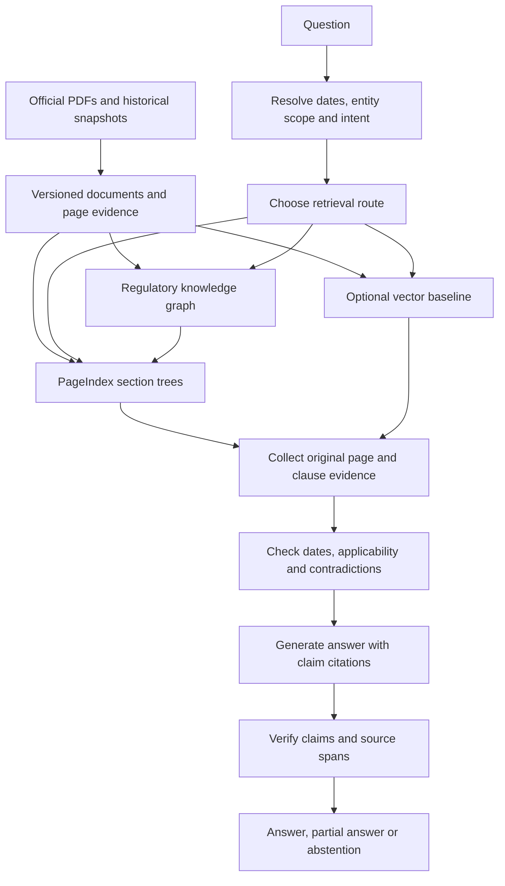

# Advanced RAG plan for ComplianceGPT

Status: proposed implementation plan; no runtime changes made.
Date: 2026-09-05.
Deployment preference: local-first, with optional hosted LLM calls and light infrastructure.

## Product objective

Answer a regulatory question with the applicable rule, its conditions and exceptions, the date it applies, and links to the exact supporting pages. Support both current-rule questions and historical comparisons when authentic historical text is available.

Build three complementary retrieval paths behind the existing API:

1. Dense/lexical baseline for direct questions and controlled comparisons.
2. PageIndex navigation for finding evidence inside long regulatory documents without embeddings.
3. A temporal regulatory knowledge graph for linking provisions, definitions, obligations, exceptions, and amendments across documents, with PageIndex/page reads providing the original evidence.

Retain the existing vector baseline until measurements justify changing the default. The graph is domain data; LangGraph remains the workflow engine. They serve different purposes.

## Why this architecture fits the current project

Existing foundations: FastAPI, LangGraph, a retrieval strategy dispatcher, Postgres documents and supersession edges, Qdrant, a configurable LLM interface, and a golden dataset. These can be extended incrementally.

Current obstacles from the audit: stale temporal caching, incomplete effective-date semantics, lost context windows, weak claim verification, and obsolete indexed content after updates. In addition, historical circulars currently have metadata but no indexed text. More retrieval machinery cannot recover historical passages that are absent.

The current parser concatenates pages into Markdown, losing explicit page boundaries. Page provenance and immutable versions must be established before either new retrieval route becomes authoritative.

## Proposed architecture



All retrieval tools enforce the allowed document/version set in code. For date comparisons, resolve two scopes and tag evidence with the date it supports. Do not union historical and current evidence into an undated context.

## Local infrastructure decisions

| Component | Initial choice | Reason |
|---|---|---|
| API and orchestration | Keep FastAPI and LangGraph | Existing code and instrumentation remain useful |
| Canonical evidence | Postgres plus local immutable PDF storage | Independent of any retrieval index |
| Knowledge graph | Typed node/edge tables in Postgres | Reuses the current database; bounded traversals need no extra service |
| Tree indexing | Official PageIndex local implementation behind an adapter | Avoid rebuilding its indexing algorithm; isolate SDK changes |
| Cross-document candidate selection | Postgres full-text search, metadata, aliases and graph links | Works without vectors and keeps navigation bounded |
| Vector baseline | Keep Qdrant as an optional Compose profile | Allows fair ablation and a gradual rollout |
| LLM | Existing provider abstraction, extended for structured outputs and usage accounting | Configurable local/hosted models; measure on real documents |
| UI | Extend Streamlit initially | Fast route to document tree, evidence and graph views |

Neo4j and corpus-wide community summaries are later options if graph scale or broad synthesis requirements justify them. They are not prerequisites for a useful graph in this corpus.

Local index/storage does not imply offline inference. With a hosted LLM, selected document text is sent to that provider. Keep provider selection explicit and profile cost rather than assuming vectorless means cheaper.

## Shared evidence model

Suggested additive migrations, with final numbering checked at implementation time:

- document_versions: immutable content hash, official source URL, capture time, parser version, storage path and extraction status. Preserve older snapshots when a URL changes.
- pages: document_version_id, physical PDF page number, printed page label, text, extraction quality and optional bounding boxes/table references.
- document_nodes: document_version_id, parent node, section/clause label, page span, source offsets and navigation summary. Namespace external PageIndex node IDs by version.
- provisions/provision_versions: stable provision identity, original source span, legal validity interval, applicability conditions and evidence for temporal boundaries.
- kg_entities/entity_aliases: canonical identifiers and regulator/domain-specific aliases.
- kg_relations: typed endpoints, valid_from/valid_to, evidence span, extraction method/model, confidence, review state and recorded_at.
- corpus_revisions/index_builds: manifests linking a consistent source snapshot to each tree, graph and optional vector build.

Physical file versions and legal effective periods are different concepts. A PDF captured today may contain later amendments; it cannot automatically establish what the rule said years ago. Represent uncertainty explicitly. Do not turn an estimated issue date into an exact effective date.

Use half-open validity intervals where known. Partial amendments close or replace affected provisions, not all content in the predecessor document. Keep the date a fact became legally effective separate from when the system learned it. Missing or unresolved applicability must produce a qualified answer or abstention.

Proposed common retrieval output:

```text
EvidenceBundle
  resolved_scope, corpus_revision, route_used, completeness_status
  passages[]
    evidence_id, document_version_id, doc_number
    page_start, page_end, printed_page_label, clause_label
    exact_text, source_url, content_hash
    valid_from, valid_to, date_provenance
    retrieval_method, rank, applicable_scope
  graph_paths[] with supporting evidence IDs
  retrieval_events[], warnings[], token_usage, latency
```

Navigation summaries and inferred graph facts help locate sources. Final claims must cite original passages. A tree traversal rank, a cosine score and graph relevance are not interchangeable probabilities.

## PageIndex retrieval flow

1. Resolve the question's dates, regulator, entity class and explicit document references before cache lookup.
2. Select candidate documents from the permitted corpus using identifiers, metadata, full-text search and graph links. Start with five candidates; widen within the request budget if evidence is insufficient. Record candidate-selection failures separately from tree-search failures.
3. Load the selected documents' trees. Ask the model for structured node selections, validate returned IDs, and read those nodes' actual page content.
4. Follow explicit cross-references through the graph and read definitions, exceptions, footnotes and table headers needed to interpret a passage.
5. Stop when the question's subparts have evidence, or return a partial answer/abstention when the budget is exhausted.
6. Return original evidence through the common bundle to the existing answer pipeline.

The official SDK exposes document structures and page content, and offers local retrieval tools usable by an existing agent. Wrap those tools with date/version scope checks and normalize returned errors; do not let the model supply arbitrary document IDs or filesystem paths. The agent-integration documentation distinguishes local document restrictions from cloud tools that can see the library, so a prompt mentioning permitted documents is not sufficient access control. [PageIndex agent integration](https://docs.pageindex.ai/sdk/agents)

Local PageIndex currently extracts embedded PDF text without local OCR. Scans need a separate OCR path, with page mapping preserved and an extraction-quality gate. Verify printed versus physical page offsets on the pilot PDFs. [PageIndex document processing](https://docs.pageindex.ai/sdk/documents)

Start with configurable limits such as two graph hops, three navigation rounds, ten candidate documents after expansion, and a bounded evidence-token budget selected after profiling. Treat these as experiment settings, not quality guarantees. Record budget exhaustion explicitly.

## Regulatory knowledge graph

Initial entity types: Regulator, RegulatedEntityClass, Document, Provision, DefinedTerm, Obligation, Exception, Threshold and ReportingRequirement.

Initial relationships: ISSUED_BY, CONTAINS, DEFINES, APPLIES_TO, REQUIRES, HAS_EXCEPTION, REFERS_TO, AMENDS, SUPERSEDES and EFFECTIVE_FROM.

Example shape, without asserting a particular real rule:

```text
Entity class <- APPLIES_TO - Obligation - EVIDENCED_BY -> Provision
                                |
                          HAS_EXCEPTION
                                v
                            Exception

New provision - AMENDS -> Earlier provision
       |                       |
   source page             source page
```

Represent an obligation as a structured claim: actor, required/prohibited action, object, condition, deadline, quantity/unit and exception links. Preserve qualifiers; do not reduce a conditional regulation to an unconditional triple.

Build in increasing order of uncertainty:

1. Deterministic document hierarchy and exact cross-references.
2. Curated entity names/aliases and existing verified supersession data.
3. Schema-constrained LLM extraction for obligations and conditions, with exact evidence spans.
4. A review queue for ambiguous identity matches, supersession, dates and unsupported links.

Separate regulator-stated facts, reviewed interpretations and unreviewed model inferences. An unreviewed similarity match must not change legal validity. Stable IDs and alias resolution must not merge distinct entity categories because names look similar.

Graph traversal retrieves a supported path and then original text. For example: entity class -> applicable obligation -> exception -> amending provision -> source page. Missing graph edges are an extraction gap, not proof that no obligation exists. Avoid claiming a checklist is exhaustive unless coverage is established.

Microsoft GraphRAG is useful as a reference: its local search combines graph information with source text; global search uses community reports and can be resource-intensive. Our initial implementation is a domain-specific temporal graph, with community-level synthesis deferred. [GraphRAG query overview](https://microsoft.github.io/graphrag/query/overview/)

## Retrieval modes and API evolution

Proposed modes: dense, lexical, pageindex, graph_pageindex, auto. Preserve existing supported strategy names for compatibility. Expose explicit modes first; add auto routing only after route-specific benchmarks pass.

| Question shape | Preferred route to evaluate |
|---|---|
| Explicit circular/paragraph lookup | Identifier lookup plus PageIndex/page read |
| Detail inside a long Master Direction | PageIndex |
| Obligations with definitions and exceptions across documents | Graph plus PageIndex |
| What changed between two dates? | Two temporal scopes, amendment graph and page evidence |
| General direct lookup | Dense/lexical baseline versus PageIndex in evaluation |
| Unsupported entity, missing historical text or contradictory evidence | Qualified partial answer or abstention |

Graph traversal can expose predecessors for history without presenting them as currently applicable. Validate applicability on every source used for an answer.

Extend the response additively with evidence IDs, page/clause references, actual retrieval route, corpus revision, validation results, coverage status and query_log_id. Show the source page and compact retrieval events in the UI, rather than an unverifiable model reasoning transcript.

A true vectorless acceptance test starts the application without Qdrant or embedding packages and successfully runs pageindex and graph_pageindex queries. Required changes include lazy strategy imports, canonical text outside Qdrant, an exact-query cache keyed by resolved scope and corpus revision, optional ML dependencies and mode-aware readiness checks. A vectorless route must never silently fall back to vector search.

## Implementation milestones

| Milestone | Work | Exit condition |
|---|---|---|
| 0. Repair and establish baseline | Audit blockers, temporal/date handling, safe cache keys, numeric checks, CI database setup; lock dependency versions | Clean tests and build; fresh baseline tied to code/corpus/model versions; failing quality thresholds remain visible |
| 1. Evidence foundation | Versioned PDF/page store; page/clause extraction; additive migrations; consistent index manifests | Every pilot passage maps to a reproducible source version and physical page; updates preserve history |
| 2. PageIndex pilot | SDK compatibility spike; scoped adapter; non-vector document selection; page reads and bounded navigation | End-to-end pageindex mode works with Qdrant and embeddings disabled; pilot questions have reviewed page evidence |
| 3. Temporal graph pilot | Typed entities, cross-references, provisions and validity; extraction review workflow | Reviewed multi-document and before/after examples produce supported graph paths and correct source versions |
| 4. Combine and verify | graph_pageindex mode; intent routing; evidence completeness; numeric/negation and claim-support checks; UI source explorer | Unsupported claims are repaired or withheld; route-specific tests and budget handling pass |
| 5. Evaluate and release | Frozen holdout, all route ablations, latency/cost report, incremental ingestion and operational checks | Candidate release passes committed quality gates with fresh artifacts; production default chosen from evidence |

Dependency order: 0 -> 1 -> 2 -> 3 -> 4 -> 5. Milestone 1 establishes IDs and provenance reused by both new indexes. Build one vertical slice before indexing the entire corpus.

First slice: five representative NBFC documents, starting with KYC and related definitions/cross-references where the actual sources support the relationship. Include short/long, tabular and exception-heavy material. Obtain a small verified historical subset if available; do not fabricate history from current amended PDFs. Prepare approximately 25 manually reviewed questions before prompt tuning.

## Code change map

- ingestion/parsing/: add page-aware evidence extraction; keep the current parser behind a compatibility path.
- ingestion/pageindex/: add a resumable tree-build adapter with content-hash caching.
- ingestion/graph/: extend supersession ingestion to supported provision/entity relations.
- app/evidence/: add canonical passage loading, scope checks and citation resolution.
- app/retrieval/: add lexical document selection, pageindex_search and graph_search; make imports optional.
- app/agent/: add structured query planning and bounded retrieval nodes; revise caching and claim validation.
- app/llm.py and observability/: capture indexing/navigation/judge calls as well as generation; SDK calls need their own usage bridge if they cannot share the existing wrapper.
- migrations/: append evidence/version/graph tables; backfill current records without destructive rebuilds.
- evals/ and tests/: add provenance, tree selection, graph paths, temporal provision and vectorless deployment cases.
- ui/streamlit_app.py: add page links, date/version display, graph paths and a development-only mode comparison.

Pin the PageIndex revision after a small compatibility test with the chosen provider. Keep external SDK schema and provider details within the adapter. Proposed file/module names above are design targets, not files already implemented.

## Evaluation and release criteria

Retain existing tests, but re-label ambiguous expected answers and build a separate development/holdout split. Target roughly 150–200 reviewed questions over direct lookups, page navigation, numeric/table facts, exceptions, multi-document paths, historical comparisons and refusals. This is a proposed dataset size, not a claim of existing coverage.

Compare dense, lexical, existing hybrid/rerank, PageIndex, graph plus PageIndex, and auto routing using the same corpus snapshot, generation model and evidence budgets. Report indexing cost separately from cold/warm query cost and p50/p95 latency. Run repeated samples for stochastic routes. Judge quality includes human spot checks; an LLM judge alone is insufficient.

Measure independently:

- Document candidate recall and supporting-page/clause recall.
- Citation location validity and claim entailment, including numbers, units and negation.
- Answer completeness, answerable coverage, and correct refusal rate.
- Date-valid citations AND successful answers on answerable historical questions.
- Graph relation precision, temporal provenance and supported multi-hop paths.
- Budget-exhaustion rate, unavailable-source rate and incremental update correctness.

Proposed release targets to set before holdout evaluation: 100% mechanically resolvable citations; zero known wrong-date/wrong-version citations on the temporal test suite; at least 90% manually assessed claim support; no regression in answerable coverage versus baseline; measurable improvement on the cross-document/exception subset. These are acceptance targets, not current results or universal guarantees. Calibrate latency and cost ceilings from the first pilot on the user's machine/provider.

Eval artifacts must match the candidate commit, corpus revision, model and prompt configuration. Outages are reported separately. A no-answer result cannot count as successful historical answering, and stale saved metrics cannot certify a new release.

## Boundaries for this plan

This document plans the work; it does not install PageIndex, call paid models, create cloud services, or change runtime behavior. The selected deployment preference is sufficient for designing the initial local stack. Model choice and paid-run budgets can be set after the small compatibility/cost profile, before large indexing or evaluation jobs.

The intended first implementation increment is audit repairs plus the versioned page-evidence foundation, followed by the five-document PageIndex slice. Broader SEBI ingestion and large-scale graph analytics follow a demonstrated NBFC result.

## Reference notes

Official sources checked on 2026-09-05. Capabilities below are vendor documentation, not project measurements:

- [PageIndex repository](https://github.com/VectifyAI/PageIndex): hierarchical document retrieval, local/cloud distinction and current SDK entry point.
- [PageIndex client configuration](https://docs.pageindex.ai/sdk/client): separate index and retrieval configuration; own-agent integration.
- [PageIndex document processing](https://docs.pageindex.ai/sdk/documents): structures, page content, local text extraction and OCR limitations.
- [PageIndex agent integration](https://docs.pageindex.ai/sdk/agents): local tools, document scope, error behavior and cloud differences.
- [Microsoft GraphRAG query overview](https://microsoft.github.io/graphrag/query/overview/): local/global/DRIFT search distinctions.

Architecture, milestones, schema choices and acceptance criteria in this document are recommendations for ComplianceGPT. Vendor benchmark scores are not extrapolated to RBI documents.
